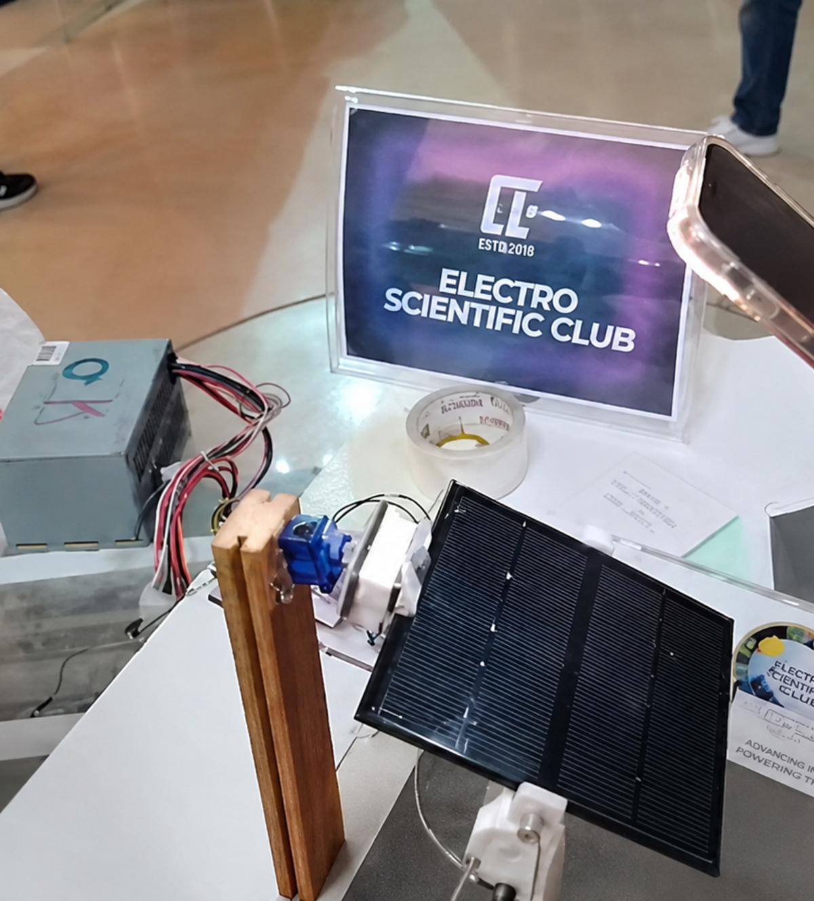
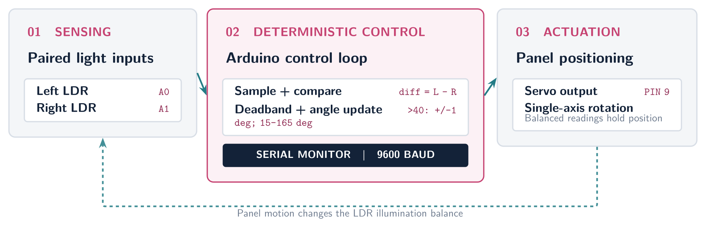

# Single-Axis Solar Tracking System

An Arduino-based closed-loop light tracker that rotates a solar panel on one axis using two LDR inputs and a servo motor.

<p align="center">
  
</p>

## Project overview

The controller samples two analog light sensors positioned on opposite sides of the tracking head. It compares their raw ADC readings and moves the panel toward the brighter side only when the difference exceeds a configurable deadband. The servo command is constrained to protect the mechanism from exceeding its intended travel range.

This repository presents the verified implementation as a **single-axis** tracker. It does not claim dual-axis motion, electrical maximum power point tracking (MPPT), or a measured energy-yield improvement.

## Key implementation details

- Two LDR analog inputs on `A0` and `A1`
- Servo control signal on digital pin `9`
- Differential-light feedback control
- `40`-count raw ADC deadband to reduce unnecessary servo movement
- `1°` incremental angle corrections
- Software travel limits from `15°` to `165°`
- Serial monitoring at `9600` baud
- `30 ms` control-loop delay

## Control architecture



The implemented control sequence is deterministic:

1. Sample the left and right LDR signals.
2. Calculate `leftLight - rightLight`.
3. Hold position when the absolute error is within the deadband.
4. Otherwise, change the servo target by one degree toward the brighter sensor.
5. Constrain the target to the configured mechanical range.
6. Command the servo and report the readings over the serial interface.

## Pin mapping

| Signal | Arduino pin | Firmware role |
|---|---:|---|
| Left LDR output | `A0` | Analog light-intensity input |
| Right LDR output | `A1` | Analog light-intensity input |
| Servo signal | `9` | Panel-position command |

The exact Arduino board, LDR resistor values, servo model, panel rating, and power-supply design were not documented in the supplied material. See [wiring and integration notes](docs/WIRING.md) before reproducing the prototype.

## Repository structure

```text
.
├── firmware/
│   └── solar_tracker_single_axis/
│       └── solar_tracker_single_axis.ino
├── docs/
│   ├── images/
│   │   ├── solar-tracker-control-architecture.png
│   │   ├── solar-tracker-control-architecture.svg
│   │   └── solar-tracker-prototype.jpg
│   ├── portfolio/
│   │   └── solar_tracking_system_portfolio_section.pdf
│   └── WIRING.md
├── .gitignore
└── README.md
```

## Run the firmware

1. Install the Arduino IDE and ensure the standard `Servo` library is available.
2. Open `firmware/solar_tracker_single_axis/solar_tracker_single_axis.ino`.
3. Select the Arduino-compatible board used for your build.
4. Connect the two conditioned LDR signals and the servo control line according to the pin table.
5. Confirm that the servo has an adequate power supply and a common ground with the controller.
6. Compile and upload the sketch.
7. Open the Serial Monitor at `9600` baud to observe both readings and the commanded angle.

## Calibration

The `TOLERANCE` value is expressed in raw ADC counts rather than calibrated irradiance. Tune it under realistic lighting so the mechanism responds to meaningful imbalance without hunting around the equilibrium point. Set `MIN_ANGLE` and `MAX_ANGLE` to match the safe physical travel of the final mechanism before testing.

If the panel turns away from the brighter sensor, reverse the sensor assignment or the direction logic only after confirming the mechanical orientation.

## Validation status

- The firmware behavior and I/O mapping are directly supported by the supplied Arduino sketch.
- A physical prototype is documented visually.
- No calibrated irradiance measurements, voltage/current logs, tracking-accuracy data, or energy-yield comparison were supplied.
- The project therefore demonstrates embedded sensing and servo control, not a quantified photovoltaic-efficiency gain.

## Proposed evolution — not yet implemented

- Add a second controlled axis, homing feedback, and end-stop protection.
- Combine an astronomical solar-position model with LDR fine correction for better operation under variable clouds.
- Measure panel voltage, current, power, and energy to compare tracking against a fixed-panel baseline; treat this separately from MPPT control.
- Add an ESP32-class supervisory layer for data logging and dashboards while keeping the real-time motion loop deterministic on the controller.

## Portfolio

The one-page engineering case study is available in [`docs/portfolio/solar_tracking_system_portfolio_section.pdf`](docs/portfolio/solar_tracking_system_portfolio_section.pdf).

## Author

**Tinhinene Boumerdassi**  
Embedded Systems & Electronics Engineer  
[Portfolio](https://tina-boumerdassi-portfolio.framer.website/) · [GitHub](https://github.com/tinaboum) · [LinkedIn](https://www.linkedin.com/in/tinhineneboumerdassi/)
